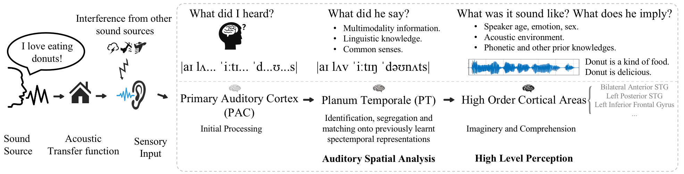
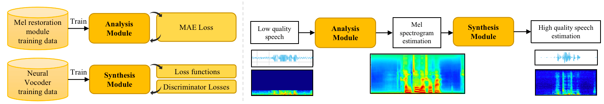
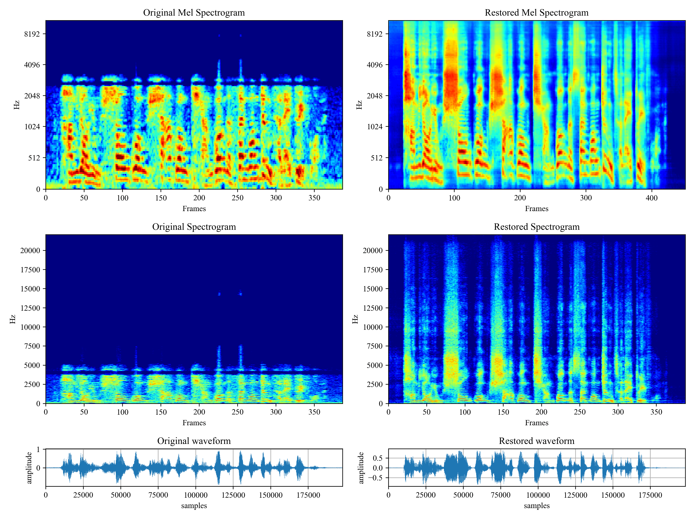

# VoiceFixer
*Voicefixer* aims at the restoration of human speech regardless how serious its degraded. It can handle noise, reveberation, low resolution (2kHz~44.1kHz) and clipping (0.1-1.0 threshold) effect within one model.




## Usage
```python
from voicefixer import VoiceFixer
voicefixer = VoiceFixer()
voicefixer.restore(input="", # input wav file path
                   output="", # output wav file path
                   cuda=False, # whether to use gpu acceleration
                   mode = 0) # You can try out mode 0, 1, 2 to find out the best result


from voicefixer import Vocoder
# Universal Speaker Independent Vocoder
vocoder = Vocoder(sample_rate=44100) # only support 44100 sample rate
vocoder.oracle(fpath="", # input wav file path
               out_path="") # output wav file path
```





