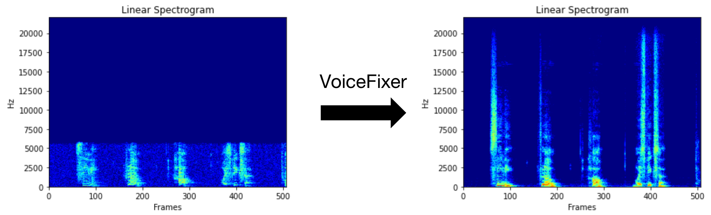
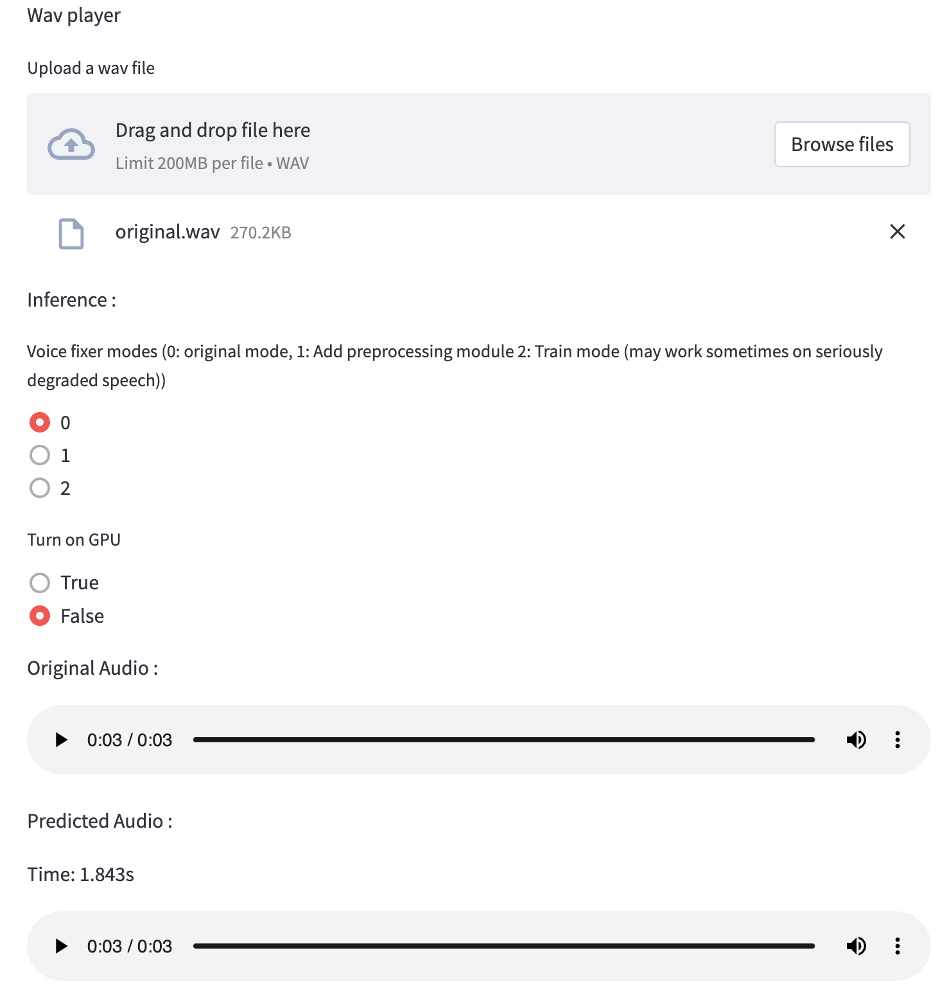

[](https://arxiv.org/abs/2109.13731) [](https://colab.research.google.com/drive/1HYYUepIsl2aXsdET6P_AmNVXuWP1MCMf?usp=sharing) [](https://badge.fury.io/py/voicefixer) [](https://haoheliu.github.io/demopage-voicefixer)[](https://huggingface.co/spaces/akhaliq/VoiceFixer)

- [:speaking_head: :wrench: VoiceFixer](#speaking_head-wrench-voicefixer)
  - [Demo](#demo)
  - [Usage](#usage)
    - [Command line](#command-line)
    - [Desktop App](#desktop-app)
    - [Python Examples](#python-examples)
    - [Others Features](#others-features)
  - [Materials](#materials)
  - [Change log](#change-log)
  
# :speaking_head: :wrench: VoiceFixer 

 *Voicefixer* aims to restore human speech regardless how serious its degraded. It can handle noise, reveberation, low resolution (2kHz~44.1kHz) and clipping (0.1-1.0 threshold) effect within one model.

This package provides: 
- A pretrained *Voicefixer*, which is build based on neural vocoder.
- A pretrained 44.1k universal speaker-independent neural vocoder.



- If you found this repo helpful, please consider citing or [](https://www.buymeacoffee.com/haoheliuP)

```bib
 @misc{liu2021voicefixer,   
     title={VoiceFixer: Toward General Speech Restoration With Neural Vocoder},   
     author={Haohe Liu and Qiuqiang Kong and Qiao Tian and Yan Zhao and DeLiang Wang and Chuanzeng Huang and Yuxuan Wang},  
     year={2021},  
     eprint={2109.13731},  
     archivePrefix={arXiv},  
     primaryClass={cs.SD}  
 }
```

## Demo

Please visit [demo page](https://haoheliu.github.io/demopage-voicefixer/) to view what voicefixer can do.

## Usage

### Command line

First, install voicefixer via pip:
```shell
pip install voicefixer==0.1.2
```

Process a file:
```shell
# Specify the input .wav file. Output file is outfile.wav.
voicefixer --infile test/utterance/original/original.wav
# Or specify a output path
voicefixer --infile test/utterance/original/original.wav --outfile test/utterance/original/original_processed.wav
```

Process files in a folder:
```shell
voicefixer --infolder /path/to/input --outfolder /path/to/output
```

Change mode (The default mode is 0):
```shell
voicefixer --infile /path/to/input.wav --outfile /path/to/output.wav --mode 1
```

Run all modes:
```shell
# output file saved to `/path/to/output-modeX.wav`.
voicefixer --infile /path/to/input.wav --outfile /path/to/output.wav --mode all
```

For more helper information please run:

```shell
voicefixer -h
```

### Desktop App

[Demo on Youtube](https://www.youtube.com/watch?v=d_j8UKTZ7J8) (Thanks @Justin John)

Install voicefixer via pip:
```shell script
pip install voicefixer==0.1.2
```

You can test audio samples on your desktop by running website (powered by [streamlit](https://streamlit.io/))

1. Clone the repo first.
```shell script
git clone https://github.com/haoheliu/voicefixer.git
cd voicefixer
```
:warning: **For windows users**, please make sure you have installed [WGET](https://eternallybored.org/misc/wget) and added the wget command to the system path (thanks @justinjohn0306).


2. Initialize and start web page.
```shell script
# Run streamlit 
streamlit run test/streamlit.py
```

- If you run for the first time: the web page may leave blank for several minutes for downloading models. You can checkout the terminal for downloading progresses.  

- You can use [this low quality speech file](https://github.com/haoheliu/voicefixer/blob/main/test/utterance/original/original.wav) we provided for a test run. The page after processing will look like the following.

<p align="center"></p>

- For users from main land China, if you experience difficulty on downloading checkpoint. You can access them alternatively on [百度网盘](https://pan.baidu.com/s/194ufkUR_PYf1nE1KqkEZjQ) (提取密码: qis6). Please download the two checkpoints inside and place them in the following folder.
  - Place **vf.ckpt** inside *~/.cache/voicefixer/analysis_module/checkpoints*. (The "~" represents your home directory)
  - Place **model.ckpt-1490000_trimed.pt** inside *~/.cache/voicefixer/synthesis_module/44100*. (The "~" represents your home directory)

### Python Examples 

First, install voicefixer via pip:
```shell script
pip install voicefixer==0.1.2
```

Then run the following scripts for a test run:

```shell script
git clone https://github.com/haoheliu/voicefixer.git; cd voicefixer
python3 test/test.py # test script
```
We expect it will give you the following output:
```shell script
Initializing VoiceFixer...
Test voicefixer mode 0, Pass
Test voicefixer mode 1, Pass
Test voicefixer mode 2, Pass
Initializing 44.1kHz speech vocoder...
Test vocoder using groundtruth mel spectrogram...
Pass
```
*test/test.py* mainly contains the test of the following two APIs:
- voicefixer.restore
- vocoder.oracle

```python
...

# TEST VOICEFIXER
## Initialize a voicefixer
print("Initializing VoiceFixer...")
voicefixer = VoiceFixer()
# Mode 0: Original Model (suggested by default)
# Mode 1: Add preprocessing module (remove higher frequency)
# Mode 2: Train mode (might work sometimes on seriously degraded real speech)
for mode in [0,1,2]:
    print("Testing mode",mode)
    voicefixer.restore(input=os.path.join(git_root,"test/utterance/original/original.flac"), # low quality .wav/.flac file
                       output=os.path.join(git_root,"test/utterance/output/output_mode_"+str(mode)+".flac"), # save file path
                       cuda=False, # GPU acceleration
                       mode=mode)
    if(mode != 2):
        check("output_mode_"+str(mode)+".flac")
    print("Pass")

# TEST VOCODER
## Initialize a vocoder
print("Initializing 44.1kHz speech vocoder...")
vocoder = Vocoder(sample_rate=44100)

### read wave (fpath) -> mel spectrogram -> vocoder -> wave -> save wave (out_path)
print("Test vocoder using groundtruth mel spectrogram...")
vocoder.oracle(fpath=os.path.join(git_root,"test/utterance/original/p360_001_mic1.flac"),
               out_path=os.path.join(git_root,"test/utterance/output/oracle.flac"),
               cuda=False) # GPU acceleration

...
```

You can clone this repo and try to run test.py inside the *test* folder.

### Others Features

- How to use your own vocoder, like pre-trained HiFi-Gan?

First you need to write a following helper function with your model. Similar to the helper function in this repo: https://github.com/haoheliu/voicefixer/blob/main/voicefixer/vocoder/base.py#L35

```shell script
    def convert_mel_to_wav(mel):
        """
        :param non normalized mel spectrogram: [batchsize, 1, t-steps, n_mel]
        :return: [batchsize, 1, samples]
        """
        return wav
```

Then pass this function to *voicefixer.restore*, for example:
```
voicefixer.restore(input="", # input wav file path
                   output="", # output wav file path
                   cuda=False, # whether to use gpu acceleration
                   mode = 0,
                   your_vocoder_func = convert_mel_to_wav)
```

Note: 
- For compatibility, your vocoder should working on 44.1kHz wave with mel frequency bins 128. 
- The input mel spectrogram to the helper function should not be normalized by the width of each mel filter. 

## Materials
- Voicefixer training: https://github.com/haoheliu/voicefixer_main.git
- Demo page: https://haoheliu.github.io/demopage-voicefixer/ 

[](https://imgtu.com/i/46dnPO)
[](https://imgtu.com/i/46dMxH)


## Change log
- 2022-09-03: Fix bugs on commandline voicefixer for windows users.
- 2022-08-18: Add commandline voicefixer tool to the pip package.


